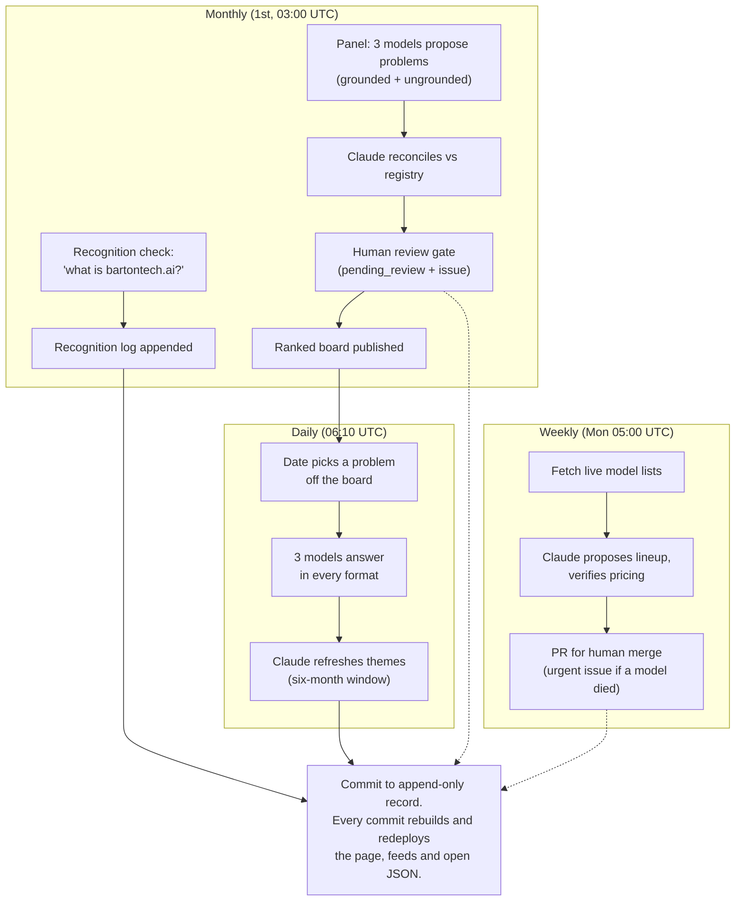

# bartontech.ai · The Martech problem index

Two records, on a fixed schedule, never backfilled. A live site at
[bartontech.ai](https://bartontech.ai), rebuilt on every commit, and a public
JSON record underneath it. The method page on the site itself carries the full
write-up with a process diagram:
[bartontech.ai/how-it-works](https://bartontech.ai/how-it-works/).

**Monthly:** ChatGPT, Claude and Gemini are asked what the martech industry's
hardest *unsolved* problems are, each twice: once from parametric knowledge,
once with web search on. Claude reconciles the proposals against a canonical
registry so one problem under three names does not become three entries, and
genuinely new entries queue for human review before they count. The result is
one ranked board per month.

**Daily:** the date deterministically picks one problem off the board and all
three models answer the same question about it: how would you attack this?
Not how to solve it; everything on the board is unsolved, and a model asked to
solve it will invent a plan. Each model answers in **every format** on the
list (a memo, three moves, pseudocode, a checklist, fifty words, a haiku).
The page opens on a date-seeded default format and a CSS-only switcher lets
the reader pick any other. Within a panel all three models share the format,
so differences are substance, not style.

**Daily, on top:** Claude reads the whole six-month record and maintains a
set of cross-cutting themes. A single-model synthesis, labeled as such, with
names held stable day to day and movement recorded as a trend.

**Monthly, on itself:** the recognition log. Each model gets one neutral
question with web search on and no hints: what is bartontech.ai? Verbatim
answers are stored append-only, including every "found nothing". Getting
named by AI answers is one of the problems on the board, so this is the site
running that experiment on itself; the log records the date each model's
"found nothing" turns into a correct answer.

## How the pieces connect



## The site

Fully server-rendered, **zero JavaScript** (the only script tag is JSON-LD).
Even the format switcher is CSS-only: hidden radio inputs, generated
per-format rules, all panels present in the document for readers and crawlers.

Homepage: hero with the day's problem in plain language; the three answers
with the format switcher; the ranked board; the themes; the recognition
check; a FAQ that generates both the visible text and the FAQPage structured
data from one source. Every day and every problem also gets its own archive
page, plus `/archive/`, `/recognition/` and `/how-it-works/`.

- Zero axe-core violations and zero incomplete checks across WCAG 2.x A/AA;
  Lighthouse 100/100/100/100 on every page type.
- Every text token measured above 4.5:1 on the surfaces it renders on. The
  dark hero band is a design element (19:1), not a theme; there is no dark
  mode and no toggle.
- robots.txt allows AI crawlers by name; llms.txt regenerates each build.
- Structured data: WebSite, WebPage (speakable), Person (with alternateName),
  Dataset, FAQPage, ItemList (mirrors the visible board), Observation,
  Question/Answer on day pages, Thing-with-aliases on problem pages,
  BreadcrumbList on all subpages.
- Atom feed, per-URL sitemap lastmod, OG/Twitter cards with a generated
  og.png.

## Layout

```
config/
  models.json          providers, tiers, pricing, budget, sampling version
  formats.json         answer formats; the switcher CSS generates from this
  anchor.json          frozen questions for the dormant vendor tracker
  problems/*.json      question sets for the dormant vendor tracker
data/
  registry/problems.json   canonical problems: definitions, plain_summary,
                           aliases, review_log. Human-gated.
  index/YYYY-MM.json       monthly boards (archive/ holds forced-rerun priors)
  solutions/YYYY-MM-DD.json  the day's answers, all formats + seeded default
  themes/YYYY-MM-DD.json     Claude's daily theme synthesis
  recognition/YYYY-MM.json   the monthly recognition log
  tracker/, raw/, batches/   the stopped vendor tracker's series, preserved
src/
  monthly-index.js       panel + reconciliation (overwrite needs --force)
  monthly-recognition.js the recognition check (overwrite needs --force)
  daily-solutions.js     all formats daily; problem and default format seeded
                         by date, so a rerun reproduces the record
  daily-themes.js        six-month synthesis, name-stable day to day
  model-refresh.js       weekly model/pricing check; ships changes as a PR
  submit-daily.js, collect-daily.js   dormant vendor tracker (spend-guarded)
  build-site.js          renders dist/ (works with empty data/)
  lib/                   providers, prompts, schemas, spend guard, rendering
```

## Workflows

| Workflow | Schedule | Does |
|---|---|---|
| daily answers | 06:10 UTC | all-format answers + themes, commits results |
| monthly problem index | 1st, 03:00 UTC | panel, reconciliation, review issue, recognition log |
| weekly model refresh | Mon 05:00 UTC | verifies model ids against live provider lists; opens a PR when the lineup should change; urgent issue if a configured model was retired |
| checks | every push and PR | syntax check, unit tests, full site build |
| keepalive | monthly | keeps schedules from being auto-disabled |
| daily submit | manual only | stopped 2026-08-19; resuming restores the cron |

Cost at current cadence: roughly $15 to 25 per month, dominated by the daily
multi-format answers (about 18 calls per day). The recognition check adds
about $0.07 per month. Every run is preceded by a spend guard that projects
its cost from measured token averages and refuses to start over budget.

## Local

```
npm ci
npm run check                # syntax-check every entry point
npm test                     # unit tests (node --test, no test dependencies)
npm run build                # render dist/ from data/ (no API calls)
npm run index:monthly        # needs API keys; refuses to overwrite a month
npm run solutions:daily      # needs API keys; skips if the day exists
npm run recognition:monthly  # needs API keys; refuses to overwrite a month
```

`build-site.js` makes no API calls and runs with zero data, so the site is
always renderable locally.

## Design rules

These are load-bearing. Breaking one silently corrupts the record.

- **Append-only.** Never edit a stored run. Forced reruns archive the prior
  version in public. The display may normalize; the data may not.
- **Registry changes are human-gated.** New canonical problems queue in
  pending_review. Promotion, merging and aliasing are editorial decisions.
- **Version the prompts.** sampling.prompt_version stamps every run; bump it
  whenever prompt text changes.
- **One shared format per panel.** Model answers are comparable only because
  style is held constant inside a panel. Every format is asked every day; the
  displayed default is seeded by the date, never rolled at build time.
- **Model answers render raw.** House punctuation (no em dashes) applies to
  everything the site authors, including themes, but never to the quoted
  model responses.
- **Models change by PR, not silently.** The weekly refresh proposes; a human
  merges. Pricing feeds the spend guard, so unverified prices never land.
- **The recognition prompt stays blind.** It must never describe the site or
  name the index; the moment the question leaks the answer, the log measures
  prompt-following instead of recognition.
